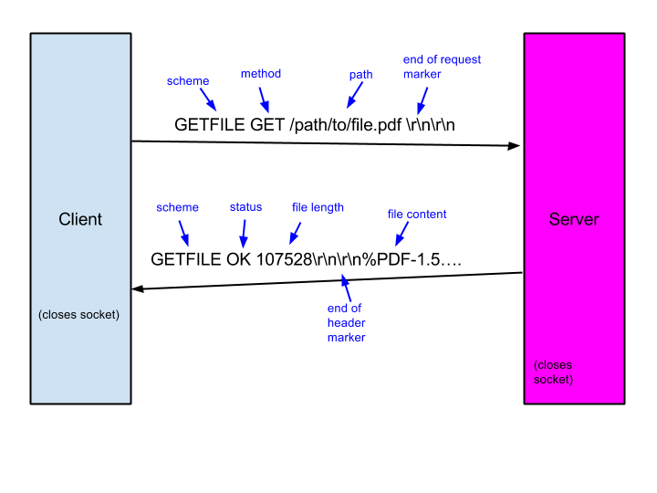

# Multithreading

## Foreword
In this project, you will design and implement a multi-threaded web server that
serves static files based on a GetFile protocol. Alongside the server, you will
also create a multi-threaded client that acts as a load generator for the
server. Both the server and client will be written in C and be based on a
sound, scalable design.

## Setup
This project relies on Docker to autograde the assignment. You can follow the
instructions [here](https://www.digitalocean.com/community/tutorials/how-to-install-and-use-docker-on-ubuntu-18-04)
for how to get Docker up and running. In order to use the `submit.py` script you will
need to follow Step 2 from that guide on how to execute Docker without sudo.

The Docker image was built on an Ubuntu 18.10 distribution. It should however work
on any system with Docker.

## Submission Instructions
All code should be submitted through the submit.py script given at the top
level of this repository.  For instructions on how to submit individual
components of the assignment see the instructions below.  

## README
Throughout the project, we encourage you to keep notes on what you have done,
how you have approached each part of the project and what resources you used in
preparing your work.  We have provided you with a prototype file,
**readme-student.md** that you should use throughout the project.

We will discuss with you when we do the Intro to CS Module Review.

## Warm-up: Sockets
In this project, your client and server will communicate via sockets.  To help
you familiarize yourself with C’s standard socket API, you will complete a few
warm-up exercises

### Echo Client-Server
Most socket tutorials start with a client-server pair where the server simply
echoes (that is, repeats back) the message that  the client sends.  Sometimes
referred to as the EchoClient and the EchoServer.   In the first part of this
assignment, you will turn in a pair of programs that perform these roles.

For this first part of the assignment, we will make some simplifying
assumptions.  You may assume that neither the message to the server nor the
response will be longer than 15 bytes.  Thus, you may statically allocate
memory (e.g. `char buffer[16];`) and then pass this memory address into send or
recv.  Because these messages are so short, you may assume that the full
message is sent or received in every send or recv call.  (If you may like, you
may detect when this is not the case by looking at the return value and simply
exiting if the full message is not sent or received).  Neither your server nor
your client should assume that the string response will be null-terminated,
however.

Your client code should support the following command-line options.
```
usage:
echoclient [options]
options:
-s                  Server (Default: localhost)
-p                  Port (Default: 8080)
-m                  Message to send to server (Default: "Hello World!”)
-h                  Show this help message
```

Note that code needed to parse these command line options is provided for you
in the starter code.  Also, it is important that the only output (either to
stdout or stderr) be the response from the server.

As for the server, its command line interface need only allow the port to be
specified. Again, the starter code shows how to parse the command line options.
```
usage:
echoserver [options]
options:
-p                  Port (Default: 8080)
-n                  Maximum pending connections
-h                  Show this help message
```

Note that your echoserver should not terminate after sending its first
response; rather, it should prepare to serve another request.  You may consult
the references suggested in this document or others on the internet.

Once you have completed your programs inside the echo directory, you may submit
it with the command
```
python submit.py echo
```

The autograder will test your echoclient.c code with its own reference
implementation of the echoserver.c and your echoserver.c code with its own
reference implementation of echoclient.c.  It will then return some feedback to
help you refine your code.

### Transferring a File
Because the network interface is a shared resource, the OS does not guarantee
that calls to `send` will copy the contents of the full range of memory that is
specified to the socket.  Instead, (for non-blocking sockets) the OS may copy
as much of the memory range as it can fit in the network buffer and then lets
the caller know how much it copied via the return value.

For example, after

```
int socket;
char *buffer
size_t length;
ssize_t sent;

/* Preparing message */
…

/*Sending message */
sent = send(socket, buffer, length, 0);

assert( sent == length); //WRONG!
```

You should *not* assume that sent has the same value as length.  The function
`send` may need to be called again (with different parameters) to ensure that
the full message is sent.

Similarly, for `recv`, for TCP sockets, the OS does not wait for the range of
memory specified to be completely filled with data from the network before the
call returns.  Instead, only a portion of the originally sent data may be
delivered from the network to the memory address specified in a `recv`
operation.  The OS will let the caller know how much data it wrote via the
return value of the `recv` call.

In several ways, this behavior is desirable, not only from the perspective of
the operating system which must ensure that resources are properly shared, but
also from the user’s perspective.  For instance, the user may have no need to
store in memory all of the data to be transferred.  If the goal is to simply
save data received over the network to disk, then this can be done a chunk at a
time without having to store the whole file in memory.

In fact, it is this strategy that you should employ as the second part of the
warm-up.  You are to create a client, which simply connects to a server--no
message need be sent-- and saves the received data to a file on disk.

Beware of file permissions.  Make sure to give yourself read and write access,
e.g. `S_IRUSR | S_IWUSR` as the last parameter to open.

Your client code should support the following command-line options.
```
usage:
transferclient [options]
options:
-s                  Server (Default: localhost)
-p                  Port (Default: 8080)
-o                  Output filename (Default: foo.txt)
-h                  Show this help message
```

A sender of data may also want to use this approach of sending it a chunk at a
time to conserve memory.  Employ this strategy as you create a server that
simply begins transferring data from a file over the network once it
establishes a connection and closes the socket when finished.

```
usage:
transferserver [options]
options:
-p                  Port (Default: 8080)
-f                  File to serve up (Default: bar.txt)
-h                  Show this help message
```

You may consult the references suggested in this document or others on the
internet. Starter code is provided inside of the transfer directory.  Once you
have completed your programs inside this directory, you may submit it with the
command
```
python submit.py transfer
```

## Part 1: Implementing the Getfile Protocol
Getfile is a simple protocol used to transfer a file from one computer to
another that we made up for this project.  A typical successful transfer is
illustrated below.



The general form of a request is

```
<scheme> <method> <path>\r\n\r\n
```

Note:

* The scheme is always GETFILE.
* The method is always GET (though there are rumors that HEAD will be added one
	day).
* The path must always start with a ‘/’.

The general form of a response is

```
<scheme> <status> <length>\r\n\r\n<content>
```

Note:
* The scheme is always GETFILE.
* The status must be in the set {‘OK’, ‘FILE_NOT_FOUND’, ‘ERROR’}.
* FILE_NOT_FOUND is the appropriate response whenever the client has made an
	error in his request.  ERROR is reserved for when the server is responsible
	for something bad happening.
* No content may be sent if the status is FILE_NOT_FOUND or ERROR.
* When the status is OK, the length should be a number expressed in ASCII (what
	sprintf will give you). The length parameter should be omitted for statuses
	of FILE_NOT_FOUND or ERROR.
* The sequence ‘\r\n\r\n’ marks the end of the header. All remaining bytes are
	the files contents.
* The space between the \<scheme> and the \<method> and the space between the \<method> and the \<path> are required. The space between the \<path> and '\r\n\r\n' is optional.
* The space between the \<scheme> and the \<status> and the space between the \<status> and the \<length> are required. The space between the \<length> and '\r\n\r\n' is optional.

### Instructions
For Part 1 of the assignment you will implement a Getfile client library and a
Getfile server library.  The API and the descriptions of the individual
functions can be found in the gfclient.h and gfserver.h header files.  Your
task is to implement these interfaces in the gfclient.c and gfserver.c files
respectively.  To help illustrate how the API is intended to be used and to
help you test your code we have provided the other files necessary to build a
simple Getfile server and workload generating client inside of the gflib
directory.  It contains the files

* Makefile - (do not modify) used for compiling the project components
* content.[ch] - (do not modify) a library that abstracts away the task of
	fetching content         from disk.
* content.txt - (modify to help test) a data file for the content library
* gfclient.c - (modify and submit) implementation of the gfclient interface.
* gfclient.h - (do not modify) header file for the gfclient library
* gfclient_download.c - (modify to help test) the main file for the client
	workload generator.  Illustrates use of gfclient library.
* gfserver.c - (modify and submit) implementation of the gfserver interface.
* gfserver.h - (do not modify) header file for the gfserver library.
* gfserver_main.c (modify to help test) the main file for the Getfile server.
	Illustrates the use of the gfserver library.
* handler.c - (modify to help test) contains the handler callback that is
	registered with the gfserver library.
* workload.[ch] - (do not modify) a library used by workload generator
* workload.txt - (modify to help test) a data file indicating what paths should
	be requested and where the results should be stored.

### gfclient
The client-side interface documented in gfclient.h is inspired by [libcurl’s
“easy” interface](http://curl.haxx.se/libcurl/c/libcurl-easy.html).  To help
illustrate how the API is intended to be used and to help you test your code,
we have provided the file gfclient_download.c. For those not familiar with
function pointers in C and callbacks, the interface can be confusing.  The key
idea is that before the user tells the gfclient library to perform a request,
he should register one function to be called on the header
(`gfc_set_headerfunc`) and register one function to be called for every “chunk”
of the body (`gfc_set_writefunc`). That is, one call to the latter function
will be made for every `recv()` call made by the gfclient library.  (It so
happens that none of the test code actually will use the header function, but
please implement your library to support it anyway.)

The user of the gfclient library may want his callback functions to have access
to data besides the information about the request provided by the gfclient
library.  For example, the write callback may need to know the file to which it
should write the data.  Thus, the user can register an argument that should be
passed to his callback on every call.  He does this with the
`gfc_set_headerarg` and `gfc_set_writearg` functions.  (Note that the user may
have multiple requests being performed at once so a global variable is not
suitable here.)

Note that the `gfcrequest_t` is used as an [opaque
pointer](https://en.wikipedia.org/wiki/Opaque_pointer), meaning that it should
be defined within the gfclient.c file and no user code (e.g.
gfclient_download.c) should ever do anything with the object besides pass it to
functions in the gfclient library.

### gfserver
The server side interface documented in gfserver.h is inspired by python’s
built-in httpserver.  The existing code in the files handler.c and
gfserver_main.c illustrate this usage.  Again, for those not  familiar with
function pointers in C and callbacks, the interface can be confusing.  The key
idea is before starting up the server, the user registers a handler callback
with gfserver library which controls how the request will be handled.  The
handler callback should not contain any of the socket-level code.  Instead, it
should use the gfs_sendheader, gfs_send, and potentially the gfs_abort
functions provided by the gfserver library.  Naturally, the gfserver library
needs to know which request the handler is working on.  All of this information
is captured in the opaque pointer passed into the handler, which the handler
must then pass back to the gfserver library when making these calls.

### Submission
Read the documentation carefully for the requirements.  When you are ready to
turn in your code, use the command
```
python submit.py gfclient
```

to turn in your gfclient.c file and

```
python submit.py gfserver
```

to turn in your gfserver.c file.

## Part 2: Implementing a Multithreaded Getfile Server

*Note: For both the client and the server, your code should follow a
boss-worker thread pattern. This is checked by the autograder.*

So far, the Getfile server can only handle a single request at a time.  To
overcome this limitation, you will make your Getfile server multi-threaded by
modifying the handler in handler.c and updating gfserver_main.c as needed.  The
main, i.e. boss, thread will continue listening to the socket and accepting new
connection requests. New connections will, however, be fully handled by worker
threads. The pool of worker threads should be initialized to the number of
threads specified as a command line argument.  You may need to add additional
initialization or worker functions in handler.c.  Use extern keyword to make
functions from handler.c available to gfserver_main.c.  For instance, the main
file will need a way to set the number of threads.

The revised command line interface should be as follows.
```
usage:
gfserver_main [options]
options:
-p                  Port (Default: 8080)
-t                  Number of threads (Default: 1)
-c                  Content file mapping keys to content files.
-h                  Show this help message
```

Similarly on the client side, the Getfile workload generator can only download
a single file at a time.  In general for clients, when server latencies are
large, this is a major disadvantage.  You will make your client multithreaded
by modifying gfclient_download.c.  This will also make testing your getfile
server easier.  The revised command line interface should be as follows.

```
usage:
gfclient_download [options]
options:
-s                  Server address (Default: localhost)
-p                  Port (Default: 8080)
-w                  Path Path to workload file (Default: workload.txt)
-t                  Number of threads (Default: 1)
-n                  Requests downloaded per thread (Default: 1)
-h                  Show this help message
```

In the client, a pool of worker threads should be initialized based on number
of client worker threads specified with a command line argument. Each worker
thread should issue up to a number of requests, also specified as a command
line argument.  You have flexibility in how your boss assigns download requests
to the individual worker threads. One option is to statically make the decision
before threads are created, and pass a per-thread workload descriptor at thread
creation time. Another option is for the boss thread to maintain a queue of
requests that are dynamically retrieved by the workers.

The folder mtgf includes the same files described above except that object
files gfclient.o and gfserver.o may be used in-place of your own
implementations.

### Submission
Read the documentation carefully for the requirements.  When you are ready to
turn in your code, use the command
```
python submit.py gfclient_mt
```

to turn in your gfclient_download.c file and

```
python submit.py gfserver_mt
```

to turn in your handler.c and gfserver_main.c files.

## References

### Sample Source Code

* [Server and Client
	Example](https://github.com/zx1986/xSinppet/tree/master/unix-socket-practice)
* [Another Tutorial with Source
	Code](http://www.cs.rpi.edu/~moorthy/Courses/os98/Pgms/socket.html)

### General References

* [POSIX Threads (PThreads)](https://computing.llnl.gov/tutorials/pthreads/)
* [Linux Sockets Tutorial](http://www.linuxhowtos.org/C_C++/socket.htm)
* [Practical TCP/IP Sockets in C](http://cs.baylor.edu/~donahoo/practical/CSockets/)
* [Guide to Network Programming](http://beej.us/guide/bgnet/)

## Helpful Hints

* [High-level code design of multi-threaded GetFile server and
	client](https://docs.google.com/drawings/d/1a2LPUBv9a3GvrrGzoDu2EY4779-tJzMJ7Sz2ArcxWFU/edit?usp=sharing)
* Return code (exit status) 11 of client or server means it received a SIGSEGV
	(segmentation fault). You can get a comprehensive list of signals with `kill
	-l`.
* In the warm-up part, the server should be running forever. It should not
	terminate after serving one request.


## Questions
For all questions, please use the class forum and chatroom
